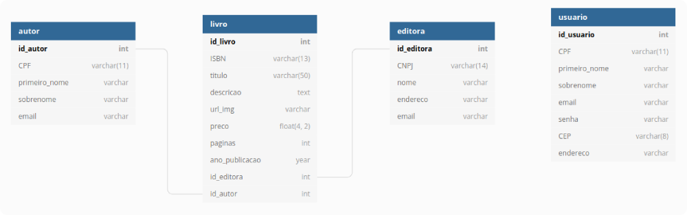

<p align="center">
  
</p>

# Bookstore API

A bookstore API REST built with NodeJS and Express (Book entity). This the project of the module 4 for Resilia that consists to create an API REST about a book of a virtual bookstore.


## Demo (Simple dashboard with CRUD)

- https://willy-r.github.io/bookstore-frontend/


## API Routes Reference

To see the full **API Reference**, access the [wiki](https://github.com/willy-r/bookstore-api/wiki) of the project.

### Routes (Book entity)

| Method | Route | Description |
| ------ | ----- | ----------- |
| **GET** | `/api/book/all` | Gets all books |
| **GET** | `/api/book/{id}` | Gets the book by {id} |
| **POST** | `/api/book` | Creates a new book |
| **PATCH** | `/api/book/{id}` | Updates the book by {id} |
| **DELETE** | `/api/book/{id}` | Deletes the book by {id} |


## General Informations

This project was made using the *NodeJS* version **14.18.1** following the design pattern: [MVC](https://en.wikipedia.org/wiki/Model-view-controller) and [DAO](https://en.wikipedia.org/wiki/Data_access_object).

### Tech Stack

Here are some libs/frameworks used in the project.

**Server:**

- [NodeJS](https://nodejs.org/en/)
- [Express](http://expressjs.com/)

**Tests:**

- [Jest](https://jestjs.io/)
- [SuperTest](https://www.npmjs.com/package/supertest)

**Database:**

- [sqlite3](https://www.npmjs.com/package/sqlite3)

> The structure used in this project was based in the [SQLite](https://www.sqlite.org/) database, and you can check the schemas in the [`schemas.js`](./src/infra/schemas.js) file.


## Run Locally

In the terminal of your choice, clone the project:

```bash
git clone https://github.com/willy-r/bookstore-api.git
```

Go to the project directory:

```bash
cd bookstore-api
```

Install dependencies:

```bash
npm install
```

Start the local server:

```bash
npm run dev
```

> This will create the server, database and populate with initial data.

## Running Tests

This application has some tests to test the routes and the Book model, to run tests, run the following command:

```bash
npm test
```


## Group 10 & Project Organization

- [William Rodrigues](https://github.com/willy-r) (Book entity)
- [Gabriela Costa](https://github.com/gabrielaalvescosta) (Author entity)
- [Ana Karolina](https://github.com/kasvrol) (User entity)
- [Aiala Priscila](https://github.com/priscilacerqueira21) (Publishing Company entity)

### Schema using [dbDiagram](https://dbdiagram.io)

<p align="center">
  
</p>


## Author

- [William Rodrigues](https://github.com/willy-r)
